# 🚀 Fee Management System – Installation & Setup Guide

A web-based **Fee Management System** built with **Django** and **Tailwind CSS** to manage students, classes, fees, and online payments efficiently.

---

## 📌 Prerequisites

Before starting, ensure you have the following installed:

* Python **3.10+**
* Git
* Virtual environment support
* Node.js & npm (required for Tailwind CSS)

---

## 🔹 Installation Guide

### 1️⃣ Clone the Repository

```bash
git clone https://github.com/sameer9860/Fee-Management-System.git
cd Fee-Management-System
```

---

### 2️⃣ Create Virtual Environment

```bash
python -m venv env
```

---

### 3️⃣ Activate Virtual Environment

**Windows (PowerShell)**

```powershell
.\env\Scripts\activate
```

**Windows (CMD)**

```cmd
env\Scripts\activate
```

**macOS / Linux**

```bash
source env/bin/activate
```

---

### 4️⃣ Install Dependencies

```bash
pip install -r requirements.txt
```

---

### 5️⃣ Apply Database Migrations

```bash
python manage.py migrate
```

---

### 6️⃣ Create Superuser (Admin)

```bash
python manage.py createsuperuser
```

👉 Follow the prompts to set up your admin account.

---

### 7️⃣ Run Django Development Server

```bash
python manage.py runserver
```

🌐 Application URL:
**[http://127.0.0.1:8000/](http://127.0.0.1:8000/)**

---

### 8️⃣ Run Tailwind CSS Server

```bash
python manage.py tailwind start
```

---

### 9️⃣ Run Django & Tailwind Together

```bash
python manage.py tailwind dev
```

---

## 🖼️ Application Screenshots

### 🏫 Fee Management System

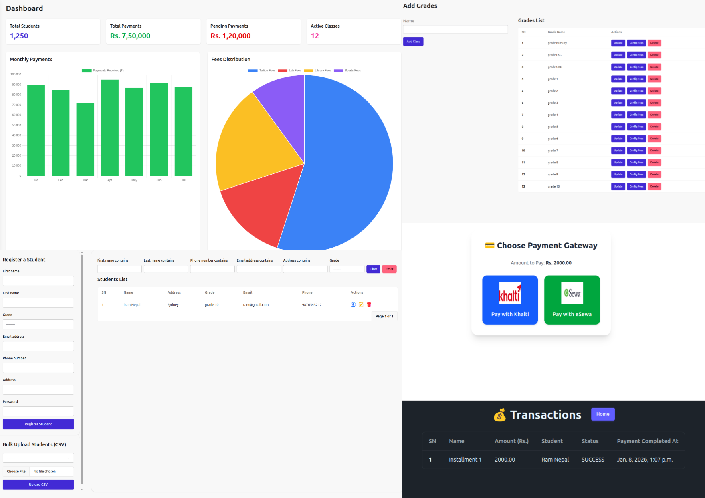

---

### 🔐 Authentication

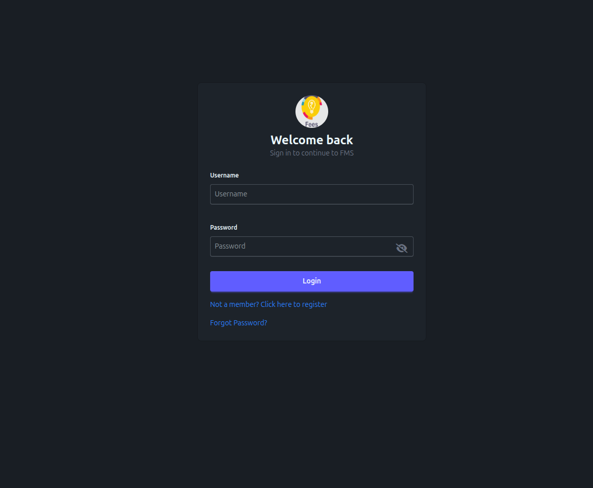


---

### 📊 Dashboards


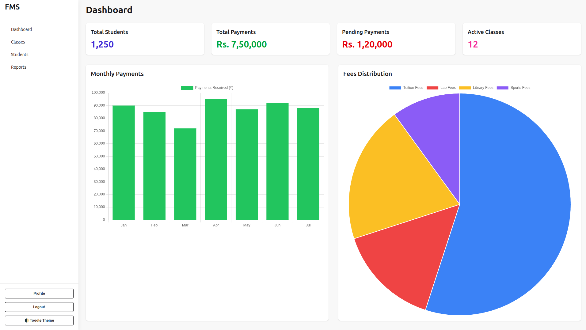

---

### 🏷️ Classes & Students

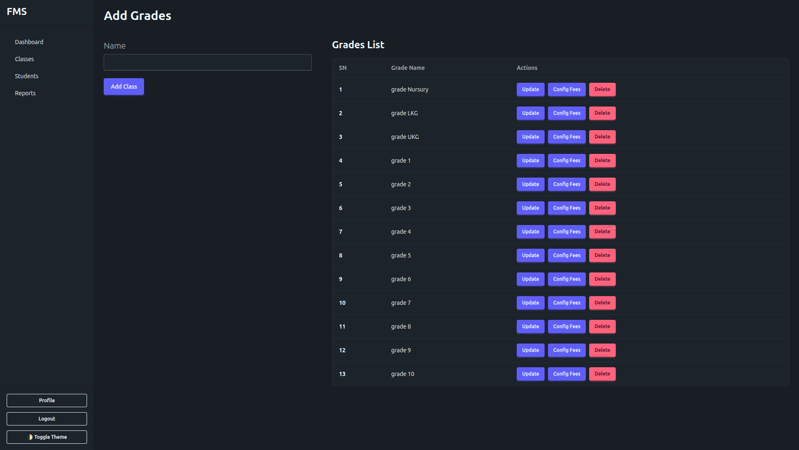
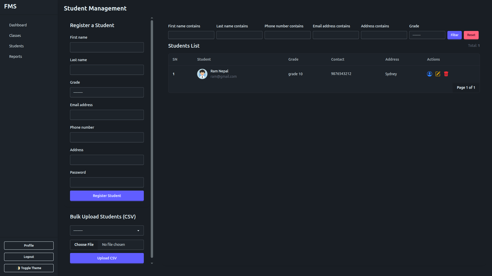

---

### 💰 Fees & Payments

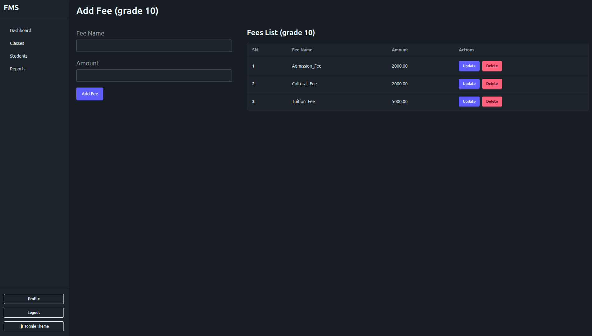

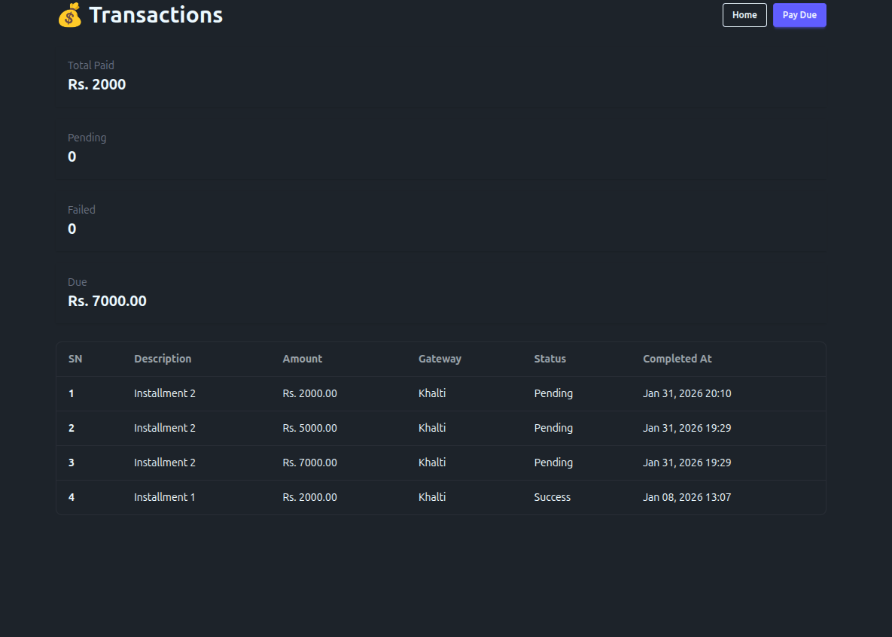

---

### 💳 Payment Gateways

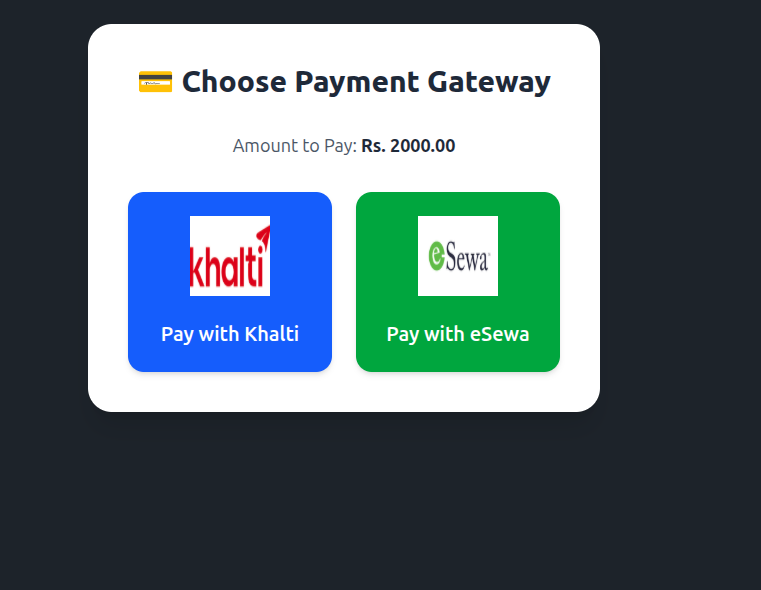
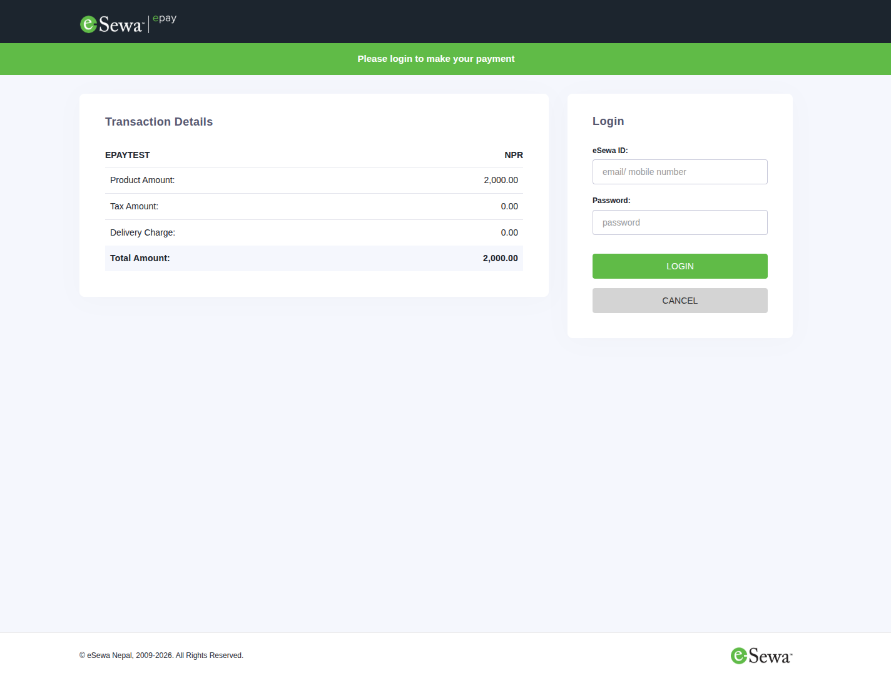
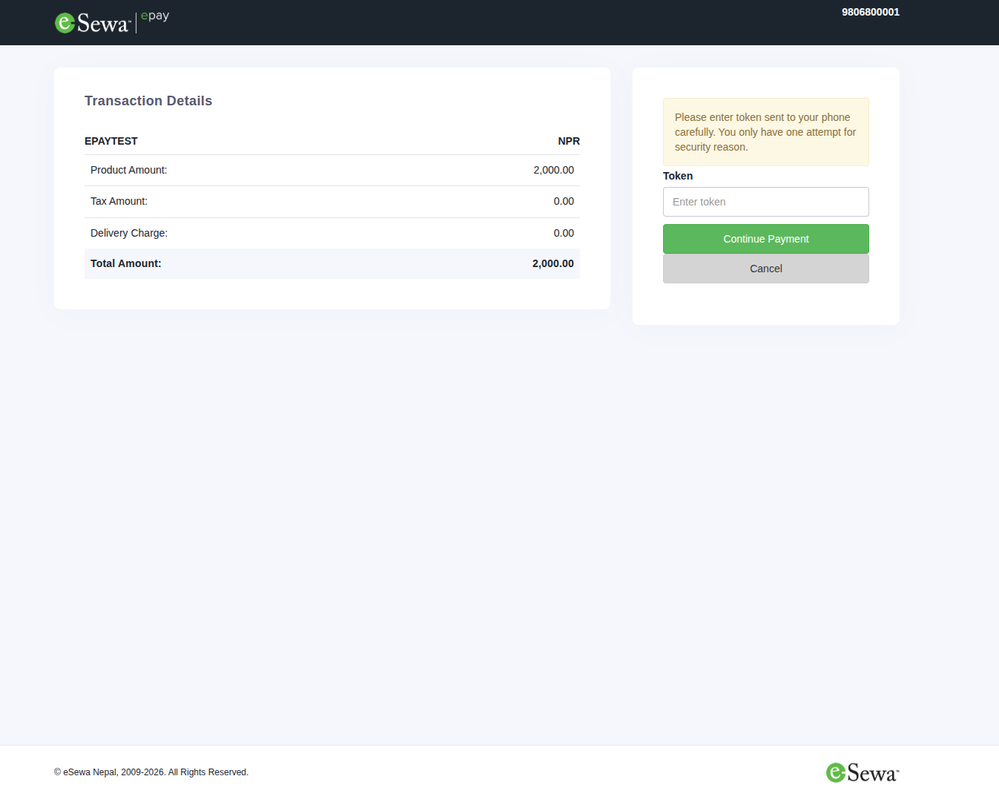
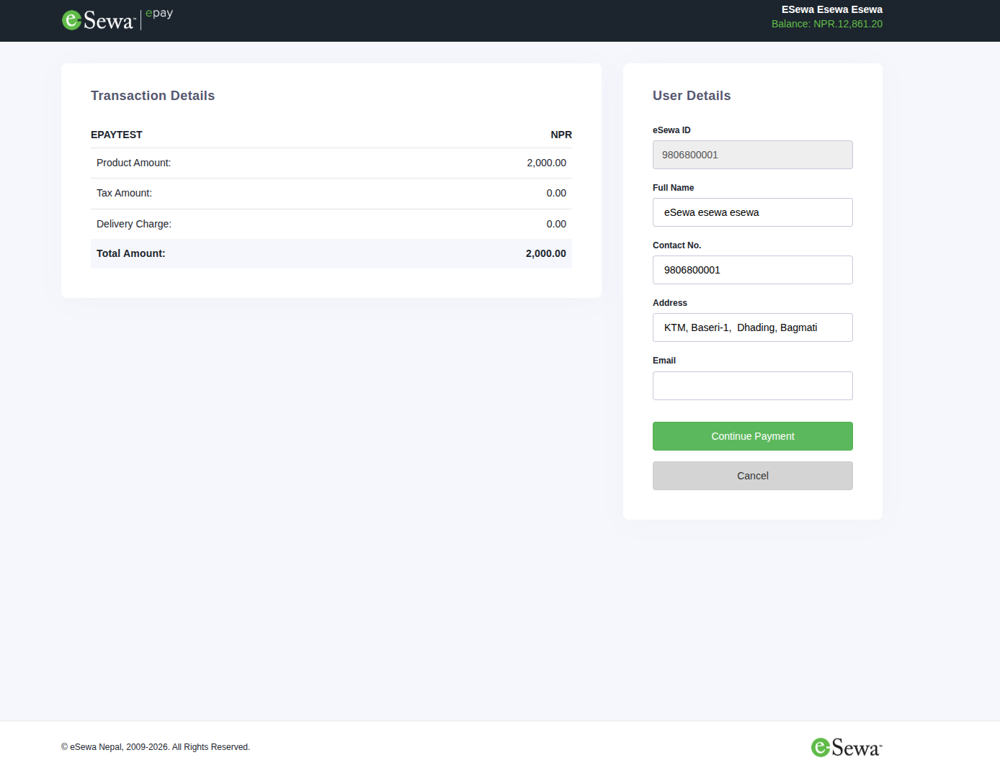
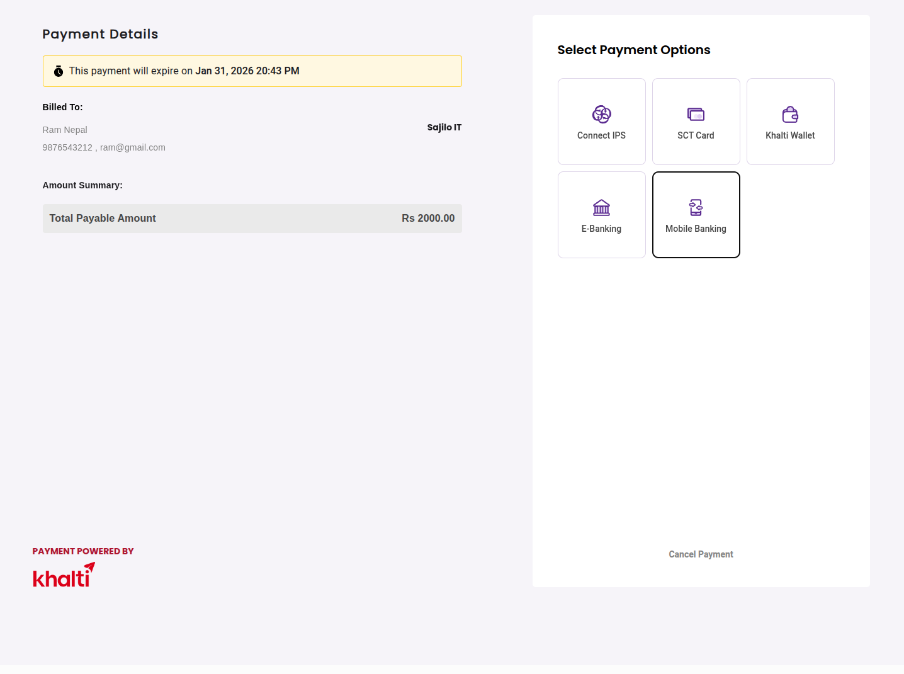
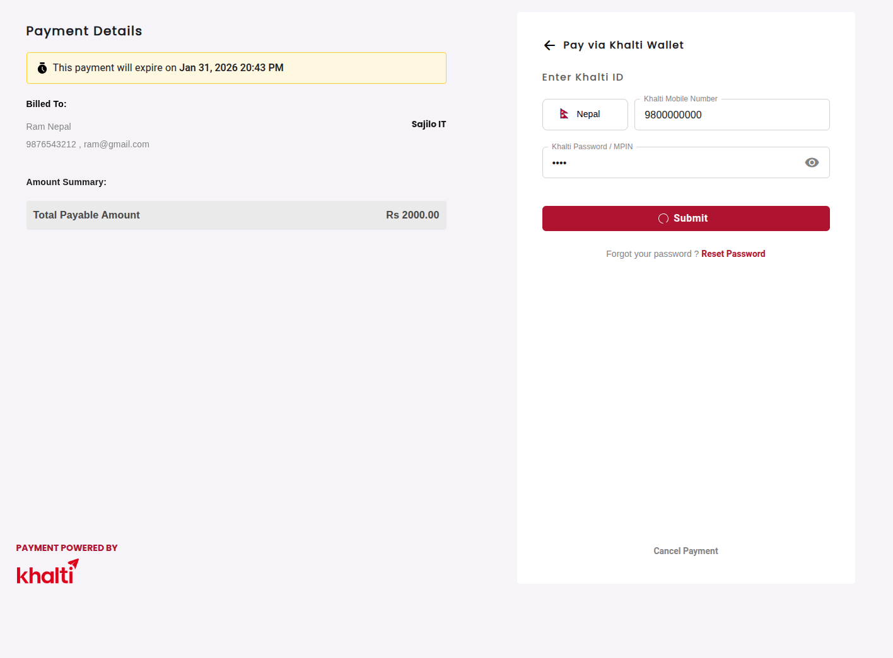

---

### 👤 Profiles

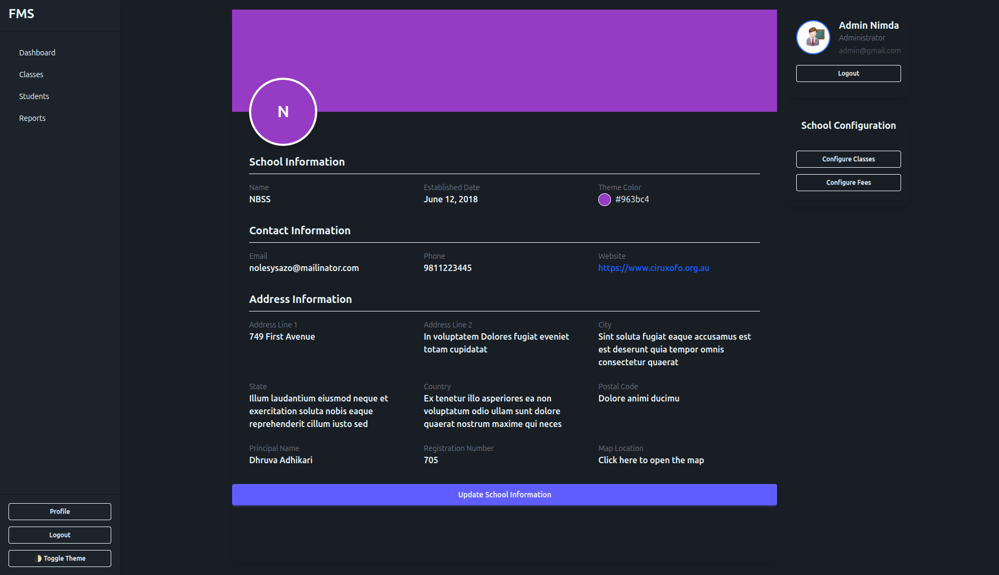
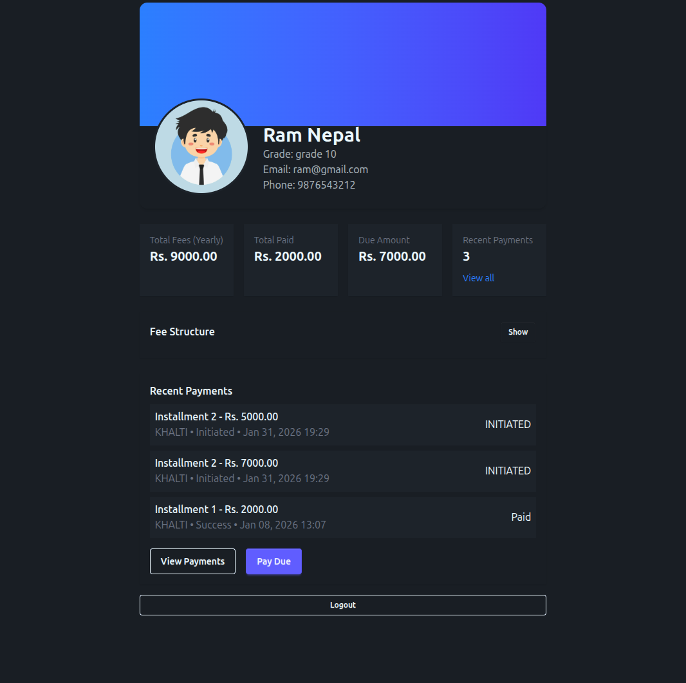

---

## ✅ Features

* Role-based Authentication (Admin & Student)
* Class & Student Management
* Fee Assignment & Tracking
* Online Payments (eSewa, Khalti)
* Payment History
* Responsive UI with Tailwind CSS

---

## 🛠️ Tech Stack

* **Backend:** Django
* **Frontend:** Django Templates, Tailwind CSS
* **Database:** SQLite / PostgreSQL
* **Payments:** eSewa, Khalti
* **Version Control:** Git & GitHub

---

## 🤝 Contributing

Contributions are welcome!

1. Fork the repository
2. Create a new branch
3. Commit your changes
4. Push to the branch
5. Open a Pull Request

---

⭐ If you like this project, don’t forget to give it a star on GitHub!
